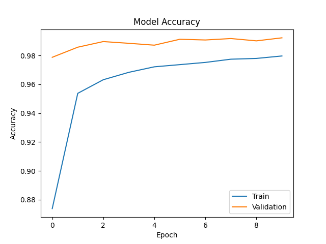
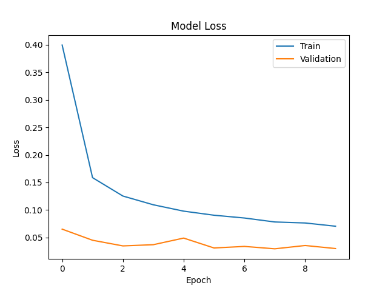
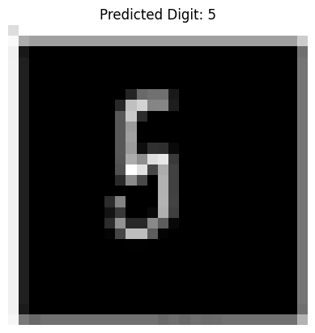

# MNIST Digit Classification using CNN

This project implements a Convolutional Neural Network (CNN) for handwritten digit recognition using the MNIST dataset.  
The model is trained to classify digits (0–9) and also supports real-world image upload for custom prediction.

## Tech Stack
- Python  
- TensorFlow / Keras  
- NumPy  
- Matplotlib  
- PIL  

## Features
- Deep CNN with Batch Normalization and Dropout  
- Data Augmentation for better generalization  
- Noise-robust training using augmented noisy samples  
- Custom image preprocessing and digit prediction  
- End-to-end training and inference in a single notebook  

## Results
- Test Accuracy: 99.07%
- Test Loss: 0.0397

The trained CNN achieves high accuracy on unseen MNIST test data, showing strong generalization and robustness.

  ## Training Curves

  

  

### Custom Image Prediction Example

  

The model correctly predicts the digit from a real handwritten image.

## How to Run
1. Open `digit_classifier.ipynb` in Google Colab or Jupyter Notebook  
2. Run all cells sequentially  
3. Upload your own digit image to test predictions  

## Use Case
This project demonstrates:
- Image classification using deep learning  
- CNN architecture design and training  
- Real-world image preprocessing for model inference  

## Author
Ayush Pandey  
IEEE Research Author | Machine Learning | Python
